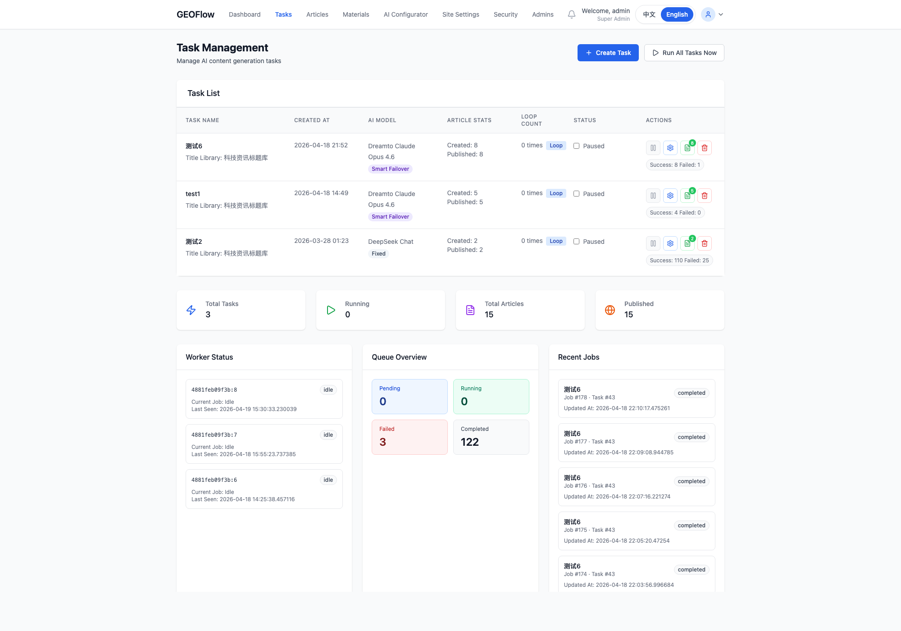
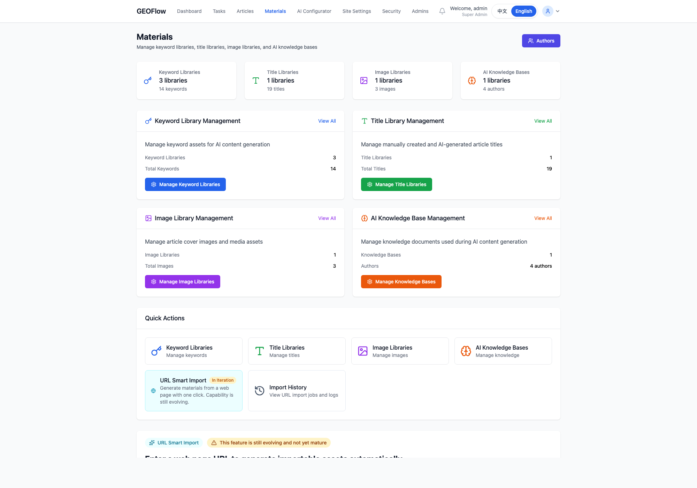

# GEOFlow

> 一个面向 GEO / SEO 内容运营场景的开源内容生产系统。它把模型配置、素材管理、任务调度、草稿审核和前台发布串成一条完整链路，适合搭建自动化内容站点或内部内容运营后台。

[](https://www.php.net/)
[](https://www.postgresql.org/)
[](https://docs.docker.com/compose/)
[](LICENSE)

Released under the Apache License 2.0.

---

## ✨ 你可以用它做什么

| 特性 | 说明 |
|------|------|
| 🤖 多模型内容生成 | 兼容 OpenAI 风格接口，可接入不同 AI 服务商 |
| 📦 批量任务运行 | 任务创建、定时调度、队列执行、失败重试 |
| 🗂 素材统一管理 | 标题库、关键词库、图片库、知识库、提示词集中管理 |
| 📋 审核与发布工作流 | 草稿、审核、发布三段式流程，可切换自动发布 |
| 🔍 面向搜索展示优化 | 文章 SEO 元信息、Open Graph、结构化数据 |
| 🐳 可直接部署 | 支持 Docker Compose，本地和服务器都能跑 |
| 🗄 PostgreSQL 运行时 | 默认基于 PostgreSQL，适合稳定运行和并发写入 |

---

## 🖼 界面预览

<p>
  
  
</p>
<p>
  
  
</p>

这四个页面基本覆盖了站点首页、任务调度、文章流程和模型配置这几条主链路。其余后台页面说明保留在 `docs/`。

---

## 🏗 运行结构

```
后台管理页面
    ↓
任务调度器 / 队列
    ↓
Worker 执行 AI 生成
    ↓
草稿 / 审核 / 发布
    ↓
前台文章与 SEO 页面输出
```

---

## 🧱 系统架构

| 层级 | 说明 |
|------|------|
| Web / Admin | 前台文章站点与后台管理页面，负责内容浏览、素材管理、任务管理和配置入口 |
| API / CLI | `/api/v1` 提供机器接口，`bin/geoflow` 提供本地 CLI 能力，适合批量任务和自动化接入 |
| Scheduler / Worker | 调度器负责扫描任务和入队，Worker 负责实际调用模型生成内容 |
| Domain Services | `includes/` 中的任务、文章、队列、AI、检索等服务承载核心业务规则 |
| Persistence | PostgreSQL 作为运行时数据库，保存任务、文章、素材、审核状态和系统配置 |

核心链路：

1. 后台配置模型、提示词和素材库
2. 创建任务并进入调度
3. 调度器写入 job queue
4. Worker 调用 AI 生成正文
5. 文章进入草稿、审核、发布链路
6. 前台输出文章与 SEO 页面

---

## 🚀 快速开始

### 方式一：Docker（推荐）

```bash
# 1. 克隆仓库
git clone https://github.com/yaojingang/GEOFlow.git
cd GEOFlow

# 2. 复制环境变量文件
cp .env.example .env

# 3. 编辑 .env，设置必要参数（见下方配置说明）
vi .env

# 4. 启动 Web、PostgreSQL、调度器与 Worker
docker compose --profile scheduler up -d --build

# 访问前台
open http://localhost:18080

# 访问后台
open http://localhost:18080/geo_admin/
```

### 方式二：本地 PHP 服务器

**前置要求:** PHP 7.4+，开启 `pdo_pgsql`、`curl` 扩展，并准备本地 PostgreSQL

```bash
# 1. 克隆仓库
git clone https://github.com/yaojingang/GEOFlow.git
cd GEOFlow

# 2. 配置数据库环境变量
export DB_DRIVER=pgsql
export DB_HOST=127.0.0.1
export DB_PORT=5432
export DB_NAME=geo_system
export DB_USER=geo_user
export DB_PASSWORD=geo_password

# 3. 启动开发服务器
php -S localhost:8080 router.php

# 访问后台
open http://localhost:8080/geo_admin/
```

## 🤝 配套 Skill

这个项目配套提供了一个公开 skill，用于通过本地 `geoflow` CLI 操作 GEOFlow 系统：

- Skill 仓库：[yaojingang/yao-geo-skills](https://github.com/yaojingang/yao-geo-skills)
- Skill 路径：`skills/geoflow-cli-ops`

适用场景：

- 通过本地 CLI 创建和管理任务
- 上传文章草稿
- 审核和发布文章
- 检查任务与 job 状态

---

## ⚙️ 环境变量配置

复制 `.env.example` 为 `.env` 并按需修改：

```dotenv
# Web 服务对外暴露端口（默认 18080）
HOST_PORT=18080

# 站点访问地址（需与 HOST_PORT 对应）
SITE_URL=http://localhost:18080

# 应用安全密钥（建议使用 32 位以上随机字符串）
APP_SECRET_KEY=replace-with-a-long-random-secret

# Cron 调度间隔（秒，默认 60）
CRON_INTERVAL=60

# 时区
TZ=Asia/Shanghai
```

---

## 📖 上手流程

1. 登录后台  
访问 `/geo_admin/`，使用管理员账号进入后台。默认管理员用户名和密码：`admin / admin888`，登录后可自行修改。

2. 配置 AI 模型  
在“AI 配置中心 → AI 模型管理”里添加模型，填写 API 地址、模型 ID 和密钥。

3. 准备素材  
创建标题库、图片库、知识库和提示词模板。

4. 创建任务  
在“任务管理”里选择标题库、模型、提示词、图片库和发布规则。

5. 启动生成  
任务进入调度与 worker 执行链路，文章会按配置生成到草稿或直接发布。

> 首次部署后，建议立刻修改管理员密码和 `APP_SECRET_KEY`。

---

## 🔄 内容生成流程

```
配置模型 / 素材 / 提示词
        ↓
创建任务
        ↓
调度器入队
        ↓
Worker 调用 AI 生成正文
        ↓
可选插图 / SEO 元信息
        ↓
草稿 / 审核 / 发布
        ↓
前台展示
```

---

## 📁 目录结构

```text
GEOFlow/
├── index.php                     前台首页入口，负责文章列表与站点聚合展示
├── article.php                   文章详情页入口，负责正文、SEO 和相关文章渲染
├── category.php                  分类页入口，按分类聚合文章
├── archive.php                   归档页入口，用于按时间浏览内容
├── router.php                    本地开发路由入口，供 `php -S` 使用
├── docker-compose.yml            开发环境编排，启动 web / postgres / scheduler / worker
├── docker-compose.prod.yml       生产环境编排模板
├── start.sh                      本地快速启动脚本
├── .env.example                  环境变量模板
│
├── admin/                        后台管理系统
│   ├── dashboard.php             后台仪表盘与统计总览
│   ├── tasks.php                 任务管理页，查看任务状态、重试、执行情况
│   ├── task-create.php           新建任务页，配置标题库、模型、提示词和发布规则
│   ├── articles.php              文章列表页，查看草稿、已发布文章与流程状态
│   ├── articles-review.php       审核中心，处理待审核文章
│   ├── materials.php             素材管理入口，统一进入标题库、图片库、知识库等
│   ├── ai-models.php             AI 模型配置页，填写模型地址、ID 和密钥
│   ├── ai-prompts.php            提示词模板管理页
│   ├── site-settings.php         站点设置页，管理站点名称、SEO、前台配置
│   └── includes/                 后台公共模板、导航和页面骨架
│
├── api/v1/                       对机器开放的 API 层
│   └── index.php                 API 单入口，负责路由分发、鉴权和响应输出
│
├── assets/                       前端静态资源
│   ├── css/                      前后台样式文件
│   ├── js/                       前后台交互脚本
│   └── images/                   默认图片与静态图标资源
│
├── bin/                          CLI 与后台运行脚本
│   ├── geoflow                   本地 CLI，供 skill 和自动化脚本调用
│   ├── cron.php                  调度器，负责扫描任务并写入队列
│   ├── worker.php                常驻 Worker，负责实际调用 AI 生成内容
│   ├── db_maintenance.php        数据库维护工具
│   ├── migrate_sqlite_to_pg.php  历史迁移脚本
│   ├── api/                      API 辅助脚本，例如 token 创建
│   └── git/                      发布同步与开源检查脚本
│
├── docker/                       容器镜像与启动辅助脚本
│   ├── Dockerfile                Web / Scheduler / Worker 多阶段镜像定义
│   ├── entrypoint.sh             Web 容器启动入口
│   ├── scheduler.sh              调度容器启动入口
│   └── php.ini                   容器内 PHP 配置
│
├── docs/                         对外文档中心
│   ├── deployment/               安装与部署文档
│   ├── project/                  API、CLI、结构说明等研发文档
│   ├── 系统说明文档.md           系统整体功能说明
│   ├── AI_PROJECT_GUIDE.md       AI 相关核心模块说明
│   └── FAQ.md                    常见问题
│
├── includes/                     核心业务逻辑与服务层
│   ├── config.php                全局配置、常量和基础运行参数
│   ├── db_support.php            数据库驱动和连接辅助函数
│   ├── database.php              前台与基础数据访问封装
│   ├── database_admin.php        后台 schema 初始化和默认数据引导
│   ├── functions.php             公共函数、Markdown 渲染、后台登录辅助
│   ├── ai_engine.php             任务执行主引擎，串起标题、正文、插图和落库
│   ├── ai_service.php            通用 AI 请求封装
│   ├── job_queue_service.php     队列 claim / complete / fail / retry 逻辑
│   ├── task_service.php          任务基础服务
│   ├── task_lifecycle_service.php 任务启动、停止、入队等生命周期动作
│   ├── article_service.php       文章创建、更新、审核、发布服务
│   ├── api_auth.php              API Bearer 鉴权
│   ├── api_token_service.php     API token 生成与校验
│   └── catalog_service.php       CLI/API 用的基础资源字典输出
│
└── data/                         运行时数据目录占位；公开仓库不附带真实数据库和业务数据
```

目录约束：

- 前台入口文件放根目录，方便直接部署和路由映射
- `admin/` 放后台页面和后台动作入口
- `api/v1/` 放正式对外 API
- `bin/` 放 CLI、调度和维护脚本
- `includes/` 放核心业务逻辑和服务层
- `docs/` 只保留对外真正需要的文档

---

## 🐳 Docker 组件

| 服务 | 说明 | 默认启动 |
|------|------|----------|
| `web` | 提供前后台 HTTP 访问 | ✅ |
| `postgres` | PostgreSQL 数据库 | ✅ |
| `scheduler` | 任务调度器 | `--profile scheduler` |
| `worker` | 常驻生成进程 | `--profile scheduler` |

```bash
# 仅启动 Web（不含调度）
docker compose up -d

# 启动完整服务（含调度器和 Worker）
docker compose --profile scheduler up -d

# 查看完整服务日志
docker compose logs -f
```

---

## 🛡 安全说明

- 所有数据库操作使用 **PDO 预处理语句**，防止 SQL 注入
- 表单提交均验证 **CSRF Token**
- 输出内容经过 **HTMLSpecialChars** 转义，防止 XSS
- 管理员密码使用 **bcrypt** 加密存储
- 支持配置安全响应头（X-Frame-Options、X-Content-Type-Options 等）

> ⚠️ 生产部署前请务必修改 `.env` 中的 `APP_SECRET_KEY`，并更新默认管理员密码。

---

## 📚 文档与扩展

详细文档见 [`docs/`](docs/) 目录：

- [系统说明文档](docs/系统说明文档.md) - 完整功能说明
- [AI 开发指南](docs/AI_PROJECT_GUIDE.md) - 核心类与架构说明
- [本地环境配置](docs/本地环境配置指南.md) - 开发环境搭建
- [部署文档](docs/deployment/DEPLOYMENT.md) - 服务器部署步骤
- [配套 Skill 仓库](https://github.com/yaojingang/yao-geo-skills) - `geoflow-cli-ops`

---

## 📌 当前开源仓库定位

- 提供可运行的公开源码版本
- 不附带生产数据库、上传文件和真实 API 密钥
- 适合作为二次开发基础，或用于自建 GEO 内容站点
