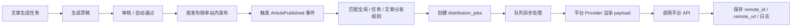

# GEOFlow 多平台分发功能一期方案

> 目标：在不影响 GEOFlow 现有站内生成、审核、发布链路的前提下，新增一套可扩展的多平台分发能力。站内发布仍是主链路，外部分发作为独立队列处理，避免外部平台 API 失败拖垮内容生产。

## 1. 功能定位

GEOFlow 当前已经具备“素材库 -> 任务生成 -> 草稿 -> 审核 -> 站内发布”的核心链路。多平台分发不应该直接写进文章生成任务，也不应该替代站内发布，而应该作为“文章发布后的外部分发层”。

推荐定位：

- 站内发布：继续由现有任务和文章状态负责，保证 GEOFlow 自有站点内容稳定上线。
- 外部分发：监听文章发布事件，按文章、任务或全局规则创建分发任务。
- 平台适配：每个平台是一个独立 Provider，统一接入认证、内容渲染、发送、失败重试和日志。
- 手动补发：文章详情或文章列表允许管理员选择平台手动分发、重试或取消。
- 合规底线：分发内容必须来自真实知识库和已审核文章，不鼓励批量污染互联网。

## 2. 现有系统接入点

当前系统里可以复用的模块：

- `Article`：已有 `status`、`published_at`、`is_hot`、`is_featured`、`task_id`、`category_id`、`author_id` 等字段，可作为外部分发源。
- `Task`：已有任务生成、发布间隔、文章总量、智能模型切换等逻辑，可扩展“任务默认分发平台”配置。
- `WorkerExecutionService`：已有草稿生成和按发布频率发布文章的主链路，适合在文章站内发布成功后触发外部分发事件。
- `ApiToken`：已有内部 API Token 和 scopes 机制，可扩展外部分发相关 API 权限。
- `SiteSetting`：已有站点设置、主题、轮播图、后台路径等配置，可增加全局默认分发策略入口。
- 后台管理：已有文章管理、任务管理、AI 配置器、网站设置、用户管理，可以新增“分发管理”并在文章/任务页面做轻量入口。

不建议直接改动的点：

- 不把第三方平台失败写回文章 `status=failed`，否则会影响站内发布结果。
- 不把外部分发 API 调用放在同步页面请求里，避免页面卡死、平台慢响应和超时。
- 不把所有平台凭据塞进站点设置表的单个 JSON 字段，后续会难以管理权限、日志和重试。

## 3. 一期核心架构

建议新增 4 个核心概念：

### 3.1 分发平台账号

表建议：`distribution_channels`

字段草案：

- `id`
- `provider`：`wordpress`、`ghost`、`wechat_official_account`、`telegram`、`webhook` 等。
- `name`：后台显示名称，例如“公司官网 WordPress”“公众号服务号”。
- `account_identifier`：站点 URL、公众号 AppID、频道 ID 等。
- `credentials_encrypted`：加密后的 API Key、Token、App Secret、Webhook Secret。
- `config`：平台特定配置，例如默认分类、标签、频道 ID、是否同步封面。
- `enabled`
- `last_checked_at`
- `last_error`
- `created_by`

### 3.2 分发规则

表建议：`distribution_rules`

字段草案：

- `scope`：`global`、`task`、`article`。
- `scope_id`：对应任务或文章 ID。
- `channel_id`
- `trigger`：`on_article_published`、`manual`、`scheduled`。
- `delay_minutes`
- `enabled`

用途：

- 全局规则：所有已发布文章默认同步到某些平台。
- 任务规则：某个任务生成的文章默认同步到指定平台。
- 文章规则：单篇文章手动选择平台。

### 3.3 分发任务

表建议：`distribution_jobs`

字段草案：

- `article_id`
- `channel_id`
- `status`：`queued`、`rendering`、`publishing`、`published`、`failed`、`cancelled`。
- `scheduled_at`
- `published_at`
- `remote_id`
- `remote_url`
- `payload_snapshot`
- `attempts`
- `last_error`
- `idempotency_key`

核心原则：

- 一篇文章对一个平台只生成一个可追踪分发任务。
- 外部分发失败只影响 `distribution_jobs`，不回滚站内文章。
- 支持重试、取消、手动重发和查看远端链接。

### 3.4 分发日志

表建议：`distribution_job_logs`

字段草案：

- `job_id`
- `level`：`info`、`warning`、`error`。
- `message`
- `context`
- `created_at`

用途：

- 后台展示每个平台的认证检查、内容渲染、API 请求、响应摘要、失败原因。
- 方便排查“平台返回 HTML 登录页”“权限不足”“Token 过期”“图片上传失败”等问题。

## 4. Provider 适配规则

建议统一一个接口：

```php
interface DistributionProvider
{
    public function key(): string;

    public function displayName(): string;

    public function validateCredentials(DistributionChannel $channel): ProviderCheckResult;

    public function renderPayload(Article $article, DistributionChannel $channel): DistributionPayload;

    public function publish(DistributionPayload $payload, DistributionChannel $channel): PublishResult;
}
```

Provider 需要解决的问题：

- 认证方式：API Key、OAuth、App Secret、Webhook URL。
- 媒体上传：是否支持封面图、正文图、远程图片 URL。
- 内容格式：HTML、Markdown、纯文本、富文本草稿。
- 标题长度：不同平台限制不同。
- 摘要/标签：是否支持分类、标签、摘要。
- 链接回流：是否支持在末尾附加原文链接。
- 失败重试：哪些错误可重试，哪些错误必须人工处理。

## 5. 后台功能改造清单

### 5.1 新增“分发管理”

建议入口：后台顶部菜单新增“分发管理”。

页面：

- 平台账号列表：显示 provider、账号名称、状态、最近检测、最近错误。
- 新增平台账号：选择平台、填写 API 信息、测试连接、保存。
- 分发队列：查看待发布、发布中、成功、失败任务。
- 分发日志：按文章、平台、状态筛选。

### 5.2 任务管理改造

在创建/编辑任务时增加：

- “外部分发平台”多选。
- “站内发布后自动分发”开关。
- “延迟分发”设置，例如站内发布后 0/10/30/60 分钟。
- “失败后自动重试”次数。

原则：

- 任务负责生成文章和站内发布节奏。
- 分发规则只决定“发布后要不要同步到外部平台”。
- 分发失败不影响任务继续生成后续文章。

### 5.3 文章管理改造

文章列表增加：

- 分发状态：未分发、排队中、部分成功、全部成功、失败。
- 分发按钮：选择平台并手动分发。
- 重试按钮：仅对失败平台展示。

文章编辑页增加：

- 分发平台预览：展示各平台将要发布的标题、摘要、正文、封面。
- 平台特定字段：例如公众号封面、WordPress 分类、Ghost tags。

### 5.4 网站设置改造

网站设置中增加轻量全局项：

- 默认分发策略：不自动分发 / 发布后自动分发到指定平台。
- 默认原文链接策略：不附加 / 附加站内原文链接。
- 默认图片策略：同步封面 / 同步正文图 / 不同步图片。

不建议把平台账号管理放在网站设置里，因为账号凭据、检测和日志更适合独立管理。

### 5.5 API Token 权限扩展

建议新增 scopes：

- `distribution:read`
- `distribution:write`
- `distribution:publish`
- `distribution:logs`

用途：

- 未来 CLI、Skill 或第三方系统可以触发补发、查询分发状态和读取日志。

## 6. 发布链路建议



关键点：

- `ArticlePublished` 事件只负责创建分发任务，不直接请求第三方 API。
- 分发任务由队列或命令行 worker 异步执行。
- 每个平台 Provider 自己处理格式转换、图片上传和平台返回。
- 所有远端返回只存摘要，不保存完整敏感响应。

## 7. 第一阶段建议范围

一期目标不应追求“大而全”，而是先把分发底座做稳。

建议 P0：

- WordPress：REST API 成熟，适合官网、博客、GEO 子频道。
- Ghost：Admin API 清晰，适合内容站和海外博客。
- 微信公众号：国内关键渠道，但需要账号权限和认证条件，适合有公众号资质的用户。
- Telegram Channel：Bot API 简单，适合海外轻量通知和社群分发。
- Generic Webhook：通用兜底，方便用户接入 n8n、Zapier、自建服务。

建议 P1：

- Dev.to / Forem：开发者内容场景明确，API 简单。
- Mastodon：开放生态，适合短内容摘要分发。
- Bluesky：AT Protocol 可发帖，适合海外社交分发。

建议 P2：

- X、LinkedIn、Facebook Pages、Instagram、抖音、微博、Bilibili、小红书、知乎、百家号、今日头条。
- 这些平台不是不能做，而是常见问题是权限、审核、商业 API、账号主体、内容格式或风控限制，不适合作为第一阶段默认能力。

## 8. 主流平台 API 可行性调研

| 平台 | 发布能力 | 个人接入便利度 | 一期建议 | 说明 |
| --- | --- | --- | --- | --- |
| WordPress | Posts / Media REST API | 高 | P0 | 用户控制站点即可，适合作为最稳定的外部分发目标。 |
| Ghost | Admin API 发布 posts | 高 | P0 | 适合自建 Ghost 或 Ghost Pro，内容模型清晰。 |
| 微信公众号 | 草稿箱、发布能力等接口 | 中低 | P0 条件支持 | 需要公众号 AppID/AppSecret 和对应接口权限，部分能力与账号类型/认证有关。 |
| Telegram Channel | Bot API 发送消息 | 高 | P0 | 适合频道通知，不等同于 SEO 内容页。 |
| Generic Webhook | 用户自定义 HTTP 回调 | 高 | P0 | 可连接 n8n、Zapier、Make、自建脚本，是最重要兜底方案。 |
| Dev.to / Forem | 创建文章 API | 高 | P1 | 适合开发者和技术内容。 |
| Mastodon | statuses API | 高 | P1 | 更适合摘要和链接分发。 |
| Bluesky | AT Protocol 发帖 | 中 | P1 | 适合短文本和链接摘要，需处理字符限制。 |
| X / Twitter | 发帖 API | 低 | P2 | API 权限、费用和限制变化较多，不适合默认承诺。 |
| LinkedIn Pages | Posts API | 中低 | P2 | 需要 OAuth、组织页权限和应用审核，更适合企业用户。 |
| Facebook Pages | Graph API Page feed | 中低 | P2 | 需要 Page 权限、应用审核和平台政策适配。 |
| Instagram | Graph API 内容发布 | 低 | P2 | 面向 Business/Creator，偏图片视频，文章分发不自然。 |
| 微博 | statuses/update 等能力 | 中低 | P2 | 开放能力存在，但权限、审核和稳定性需要单独验证。 |
| 抖音 | 内容管理/视频发布能力 | 低 | P2 | 更适合视频内容和企业/开放平台应用，不适合一期文章分发。 |
| Bilibili | 开放平台能力 | 低 | P2 | 以视频和互动为主，文章分发不是首选。 |
| 小红书 | 开放合作能力 | 低 | P2 | 内容发布接口通常不面向所有个人开发者开放。 |
| 知乎 | 开放能力有限 | 低 | P2 | 更适合后续人工辅助发布或浏览器自动化，不建议 API 默认承诺。 |
| 百家号 / 今日头条 | 内容平台开放能力不稳定 | 低 | P2 | 需逐平台确认账号主体、权限和风控策略。 |

## 9. 平台适配优先级

一期落地顺序建议：

1. Generic Webhook：先把底座打通，任何平台都可以通过中间件承接。
2. WordPress：最适合验证文章、图片、分类、标签、原文链接同步。
3. Ghost：验证另一个成熟内容系统的适配抽象。
4. 微信公众号：国内最有价值，但必须把权限检测和失败说明做清楚。
5. Telegram / Discord：验证轻量通知型分发，不与长文发布混在一起。

## 10. 凭据与安全设计

必须做：

- 所有第三方 API Key、Token、App Secret 使用 Laravel 加密存储。
- 后台展示只显示掩码，不回显完整密钥。
- 测试连接时不保存完整响应，只保存状态摘要。
- 分发日志不记录 Authorization header、access token、refresh token。
- 用户删除平台账号时，保留历史分发记录，但清空或失效凭据。

建议做：

- 对 OAuth 平台单独抽象 refresh token 刷新机制。
- 对 Webhook 支持签名 header，减少伪造请求风险。
- 对平台调用增加速率限制和指数退避。

## 11. 内容合规与质量底线

多平台分发会放大内容影响，所以系统需要明确底线：

- 不鼓励伪造信息、批量搬运、低质量采集和污染互联网。
- 默认只分发已发布或已审核文章，不分发未审核草稿。
- 建议保留站内原文链接和来源信息。
- 平台要求声明 AI 生成或商业合作时，需要在 Provider 配置中支持声明字段。
- 对用户自定义 Webhook，要提示用户自行遵守目标平台规则。

## 12. 后续实施计划

### Phase 1：底座与 P0 Provider

- 新增数据表：channels、rules、jobs、logs。
- 新增 Provider interface 和 Webhook / WordPress / Ghost Provider。
- 新增后台“分发管理”基础页面。
- 文章发布后自动创建分发任务。
- 文章列表展示分发状态和重试入口。

### Phase 2：公众号与任务级策略

- 微信公众号 Provider：草稿、发布、封面图、错误提示。
- 任务创建/编辑页增加分发平台选择。
- 分发队列增加定时发布和失败重试策略。
- 增加平台 payload 预览。

### Phase 3：更多平台与 Skill / CLI

- Telegram、Mastodon、Bluesky、Dev.to Provider。
- CLI 支持查询分发队列、重试、手动分发。
- Skill 支持根据平台规则调整标题、摘要和正文。
- 增加平台健康检查和每日更新提醒。

## 13. 需要确认的问题

- 第一期是否把微信公众号列为 P0 必做，还是先做 WordPress / Ghost / Webhook 验证底座？
- 外部分发默认是否要附加站内原文链接？
- 分发失败是否需要通知管理员，通知入口用现有右上角通知铃铛还是单独页面？
- 平台账号是否只允许超级管理员管理？
- 是否允许同一篇文章多次分发到同一平台，还是默认一篇文章一个平台只允许一次成功记录？

## 14. 官方资料参考

- WordPress REST API Posts: https://developer.wordpress.org/rest-api/reference/posts/
- WordPress REST API Media: https://developer.wordpress.org/rest-api/reference/media/
- Ghost Admin API Posts: https://docs.ghost.org/admin-api/posts/
- DEV / Forem API: https://developers.forem.com/api/v1
- Mastodon Statuses API: https://docs.joinmastodon.org/methods/statuses/
- Bluesky 创建帖子文档: https://docs.bsky.app/docs/tutorials/creating-a-post
- Telegram Bot API sendMessage: https://core.telegram.org/bots/api#sendmessage
- Discord Execute Webhook: https://discord.com/developers/docs/resources/webhook#execute-webhook
- X API Manage Tweets: https://docs.x.com/x-api/posts/manage-tweets/introduction
- LinkedIn Posts API: https://learn.microsoft.com/en-us/linkedin/marketing/community-management/shares/posts-api
- Facebook Graph API Page Feed: https://developers.facebook.com/docs/graph-api/reference/page/feed
- 微信公众号新增草稿: https://developers.weixin.qq.com/doc/offiaccount/Draft_Box/Add_draft.html
- 微信公众号发布能力: https://developers.weixin.qq.com/doc/offiaccount/Publish/Publish.html
- 抖音开放平台内容管理: https://developer.open-douyin.com/docs/resource/zh-CN/dop/develop/openapi/video-management/upload-video/
- 微博开放平台 statuses/update: https://open.weibo.com/wiki/2/statuses/update
