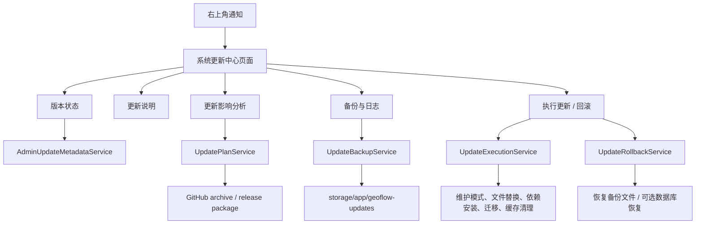
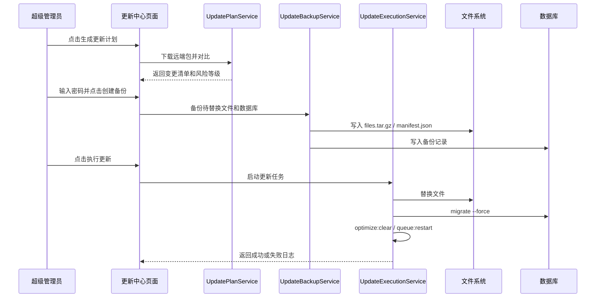

# GEOFlow 系统更新中心实施方案

版本：v0.1
日期：2026-06-01
状态：待确认

## 1. 背景

当前后台右上角通知已经支持从 GitHub `version.json` 检查版本，并在下拉通知中展示当前版本、最新版本、检查时间、更新日志和 GitHub 链接。

现有能力适合“提醒”，但还不是完整的“系统更新中心”。下一步可以把它升级为一个独立页面，让管理员看到版本状态、更新内容、影响分析、备份记录、更新日志和回滚入口。

这类功能本质上是远程代码更新，风险高于普通后台功能。设计重点不是“能不能下载新代码”，而是：

- 是否能识别部署模式；
- 是否能避免覆盖本地改动；
- 是否能先备份再更新；
- 是否能清楚记录每一步；
- 是否能在失败时恢复到可控状态；
- 是否能避免让 Web 后台拥有过大的系统权限。

## 2. 建设目标

建设一个后台“系统更新中心”，从右上角通知入口进入，提供以下能力：

1. 查看当前版本、最新版本、当前提交、远端提交、检查状态和更新时间。
2. 查看 GitHub 仓库、更新日志、Release 链接和版本摘要。
3. 手动检查更新，刷新 GitHub 版本元数据。
4. 生成更新计划，分析新增、修改、删除文件，以及依赖、迁移、Docker 配置风险。
5. 创建更新前备份，保存待替换文件、数据库备份、更新计划和日志。
6. 在满足安全条件时执行一键更新。
7. 保留最近 10 次更新备份。
8. 支持从备份回滚到上一版本，或按文件恢复指定文件。

## 3. 不做的范围

第一版不做以下能力：

- 不在 Web 容器内直接控制 Docker socket。
- 不自动更新生产 Docker 镜像。
- 不支持跨大版本复杂数据库结构回滚。
- 不从任意第三方 URL 下载更新包。
- 不支持绕过本地代码变更强制覆盖。
- 不承诺所有私有改造版都能自动升级。

生产 Docker 镜像部署更适合通过外部部署脚本、CI/CD 或人工执行。已有部署必须遵循 [`deployment/DEPLOYMENT.md` 3.1 节](deployment/DEPLOYMENT.md#31-受管图片删除升级门禁)的停机排空、安全迁移和 readiness 流程，禁止用 `git pull`、`up -d --build` 和直接迁移命令替代该流程。

后台更新中心可以展示这些命令和风险提示，但不建议第一版直接执行宿主机 Docker 操作。

## 4. 当前能力复用

现有代码中已经具备以下基础：

- `AdminUpdateMetadataService`：拉取 GitHub `version.json` 并判断是否有新版本。
- `config/geoflow.php`：
  - `GEOFLOW_APP_VERSION`
  - `GEOFLOW_UPDATE_CHECK_ENABLED`
  - `GEOFLOW_UPDATE_METADATA_URL`
  - `GEOFLOW_UPDATE_METADATA_CACHE_TTL`
- `resources/views/admin/partials/header.blade.php`：右上角通知下拉。
- 多语言文案结构：`lang/zh_CN/admin.php`、`lang/en/admin.php` 等。
- 超级管理员判断：后台 header 已经使用 `isSuperAdmin()`。

升级时应复用这些能力，不另起一套版本检测逻辑。

## 5. 推荐总体架构



## 6. 页面设计

新增后台页面：

```text
/admin/system-updates
```

导航入口：

- 右上角通知下拉中增加“进入更新中心”。
- 如果有更新，下拉继续显示红点和版本摘要。
- 如果无更新，也可以进入更新中心查看当前版本和检查日志。

### 6.1 顶部状态区

展示：

- 当前版本；
- 最新版本；
- 当前 commit；
- 远端 commit；
- 当前运行环境；
- 部署模式；
- 最近检查时间；
- 更新状态。

状态建议：

- `current`：当前已是最新；
- `available`：发现新版本；
- `checking`：正在检查；
- `planned`：已生成更新计划；
- `backup_ready`：已创建备份；
- `updating`：正在更新；
- `updated`：更新成功；
- `failed`：更新失败；
- `rollback_available`：可回滚；
- `unsupported`：当前部署模式不支持后台直接更新。

### 6.2 更新说明区

展示远端 `version.json` payload：

- 版本标题；
- 发布时间；
- 更新摘要；
- 升级提示；
- 更新日志链接；
- GitHub 仓库链接；
- Release 链接。

### 6.3 部署模式检测区

更新中心必须先判断当前系统属于哪类部署：

| 模式 | 判断方式 | 是否允许后台一键更新 |
| --- | --- | --- |
| Git 工作区源码部署 | 存在 `.git`，代码目录可写 | 可以，但需检查本地改动 |
| Docker bind mount 开发部署 | 容器内代码目录挂载宿主源码 | 可以，但仍需检查本地改动 |
| Docker 生产镜像部署 | 无 `.git` 或代码目录不可写 | 不建议，显示手动升级命令 |
| 压缩包手动部署 | 无 `.git`，代码目录可写 | 可支持下载包替换，但风险较高，建议第二阶段后开启 |
| 只读环境 | 代码目录不可写 | 不支持，只显示说明 |

检测项：

- `base_path()` 是否可写；
- `.git` 是否存在；
- `git rev-parse HEAD` 是否可用；
- `composer` 是否可用；
- `php artisan migrate:status` 是否可用；
- `storage/app` 是否可写；
- 数据库连接是否正常；
- 当前管理员是否为超级管理员。

### 6.4 更新影响分析区

点击“生成更新计划”后展示：

- 新增文件数量；
- 修改文件数量；
- 删除文件数量；
- 是否修改 `composer.lock`；
- 是否修改 `package-lock.json`；
- 是否包含数据库迁移；
- 是否修改 Docker 配置；
- 是否修改 `.env.example` / `.env.prod.example`；
- 是否修改 `public/` 前端资源；
- 是否修改 `routes/`、`config/`、`database/` 等高风险目录；
- 风险等级；
- 建议操作。

风险等级建议：

- 低：仅文案、视图、普通 PHP 文件；
- 中：涉及配置、路由、任务、服务类、前端资源；
- 高：涉及数据库迁移、依赖锁文件、Docker、认证、安全、队列、分发协议。

### 6.5 备份与日志区

展示最近 10 次备份：

- 备份时间；
- 更新前版本；
- 更新目标版本；
- 操作管理员；
- 备份大小；
- 文件数量；
- 是否包含数据库备份；
- 状态：可用 / 部分可用 / 已损坏 / 已清理；
- 查看日志；
- 下载备份；
- 回滚。

### 6.6 操作区

按钮顺序：

1. 手动检查更新；
2. 生成更新计划；
3. 创建备份；
4. 执行更新；
5. 回滚到上一版本；
6. 查看更新日志。

高风险操作要求：

- 仅超级管理员可见；
- 要求输入当前管理员密码；
- 更新和回滚都需要二次确认；
- 更新执行期间按钮置灰；
- 页面显示实时步骤和日志。

## 7. 更新包与版本元数据

建议扩展 `version.json`：

```json
{
  "version": "2.0.3",
  "release_date": "2026-06-01",
  "release_type": "patch",
  "commit": "xxxxxxxxxxxxxxxxxxxxxxxxxxxxxxxxxxxxxxxx",
  "tag": "v2.0.3",
  "archive_url": "https://github.com/yaojingang/GEOFlow/archive/refs/tags/v2.0.3.zip",
  "archive_sha256": "2f4c7fb12a5d8f3c46b9a1e2d5c6a7f88d9e0b1c2a3f4d5e6f708192a3b4c5d6",
  "payload": {
    "title_zh": "GEOFlow v2.0.3",
    "summary_zh": "优化系统更新中心、更新计划、备份与回滚基础能力。",
    "upgrade_tip_zh": "升级前请确认数据库和上传目录已经备份，并在更新中心生成更新计划。",
    "release_url": "https://github.com/yaojingang/GEOFlow/releases/tag/v2.0.3",
    "changelog_url_zh": "https://github.com/yaojingang/GEOFlow/blob/main/docs/CHANGELOG.md",
    "changelog_url_en": "https://github.com/yaojingang/GEOFlow/blob/main/docs/CHANGELOG_en.md"
  }
}
```

第一版可以先兼容旧格式，只要没有 `archive_url` 或 `commit`，就只显示版本提醒，不开放一键更新。

## 8. 更新文件边界

允许参与更新的文件：

- `app/`
- `bootstrap/`
- `config/`
- `database/`
- `lang/`
- `public/`
- `resources/`
- `routes/`
- `tests/`
- `docker/`
- `docs/`
- 根目录公开配置文件，如 `composer.json`、`composer.lock`、`package.json`、`package-lock.json`、`vite.config.js`、`version.json`

默认禁止自动覆盖：

- `.env`
- `.env.prod`
- `storage/`
- `vendor/`
- `node_modules/`
- `docker-data/`
- `uploads/`
- `public/assets/images/`
- `public/storage/`
- `logs/`
- `.git/`
- `.longtask/`
- 运行时缓存和用户上传文件。

如果远端更新包含被禁止覆盖的路径，更新计划中标记为“人工处理”。

## 9. 数据库设计

建议新增两张表。

### 9.1 `system_update_runs`

记录每次检查、计划、备份、更新、回滚。

字段建议：

- `id`
- `run_uuid`
- `action`：`check` / `plan` / `backup` / `update` / `rollback`
- `status`：`pending` / `running` / `succeeded` / `failed` / `cancelled`
- `current_version`
- `target_version`
- `current_commit`
- `target_commit`
- `deployment_mode`
- `risk_level`
- `plan_json`
- `backup_path`
- `log_path`
- `error_message`
- `started_by_admin_id`
- `started_at`
- `finished_at`
- `created_at`
- `updated_at`

### 9.2 `system_update_backups`

记录可回滚备份。

字段建议：

- `id`
- `backup_uuid`
- `run_id`
- `from_version`
- `to_version`
- `from_commit`
- `to_commit`
- `backup_path`
- `manifest_path`
- `files_archive_path`
- `database_dump_path`
- `file_count`
- `total_bytes`
- `status`
- `created_by_admin_id`
- `created_at`
- `updated_at`

## 10. 文件目录结构

更新中心所有运行时文件放在：

```text
storage/app/geoflow-updates/
  downloads/
    {version}-{commit}.zip
  extracted/
    {run_uuid}/
  plans/
    {run_uuid}.json
  backups/
    {backup_uuid}/
      manifest.json
      files.tar.gz
      database.sql
      plan.json
      update.log
      rollback.log
  logs/
    {run_uuid}.log
  locks/
    update.lock
```

保留策略：

- 最近 10 次备份保留；
- 正在使用的备份不清理；
- 失败更新的备份不自动清理；
- 下载包和解压目录可在更新完成后清理；
- 日志跟随备份保留。

## 11. 核心服务设计

### 11.1 `SystemUpdateCenterController`

负责后台页面与操作入口：

- `index`
- `check`
- `plan`
- `backup`
- `update`
- `rollback`
- `logs`
- `downloadBackup`

### 11.2 `SystemUpdateStateService`

负责聚合页面状态：

- 当前版本；
- 远端版本；
- 当前 commit；
- 部署模式；
- 最近更新记录；
- 最近备份；
- 是否可更新；
- 是否可回滚。

### 11.3 `SystemUpdatePlanService`

负责生成更新计划：

- 下载远端包；
- 解压到临时目录；
- 对比本地文件；
- 分类新增、修改、删除；
- 判断依赖、迁移、Docker、配置风险；
- 输出 `plan.json`。

### 11.4 `SystemUpdateBackupService`

负责备份：

- 根据 plan 备份待替换文件；
- 如涉及 migration，执行数据库备份；
- 写入 `manifest.json`；
- 清理超过 10 次的旧备份。

### 11.5 `SystemUpdateExecutionService`

负责执行更新：

- 加锁；
- 进入维护模式；
- 停止或重启队列；
- 替换文件；
- 安装依赖；
- 执行迁移；
- 清缓存；
- 退出维护模式；
- 写入日志；
- 出错时尝试恢复文件。

### 11.6 `SystemUpdateRollbackService`

负责回滚：

- 读取备份 manifest；
- 校验备份完整性；
- 恢复文件；
- 可选恢复数据库；
- 清缓存；
- 写入回滚日志。

## 12. 更新执行流程



## 13. 安全规则

必须满足以下条件才允许执行更新：

- 当前管理员是超级管理员；
- 当前管理员重新输入密码通过；
- 没有正在执行的更新任务；
- 系统能创建锁文件；
- `storage/app/geoflow-updates` 可写；
- 当前部署模式支持后台更新；
- 更新计划已生成；
- 更新前备份已创建；
- 本地工作区没有未处理代码改动；
- 远端包校验通过；
- 更新来源是配置中的官方 GitHub 仓库。

否则只允许查看信息，不允许执行更新。

## 14. 部署模式处理策略

### 14.1 Git 工作区源码部署

推荐策略：

- 使用 `git status --porcelain` 检测本地改动；
- 如果有本地改动，阻止更新；
- 如果干净，可选择：
  - 下载 archive 包替换文件；
  - 或执行受控 `git fetch` + `git checkout`。

第一版建议使用 archive 包替换，逻辑更可控。

### 14.2 Docker bind mount 开发部署

本地开发环境可支持：

- 因为容器内 `/var/www/html` 挂载宿主源码；
- 文件替换实际会写到宿主机；
- 更新后需要提示用户重建容器或重启服务；
- 如果 `.env` 中版本变量旧值覆盖新默认值，需要提示同步调整。

### 14.3 Docker 生产镜像部署

第一版不执行代码替换。

页面展示：

- 当前为 Docker 镜像部署；
- 建议使用 GitHub 最新代码重新 build；
- 展示升级命令；
- 支持查看版本和更新日志；
- 支持下载备份，但不执行一键更新。

原因：

- 容器内文件替换不会改变镜像；
- 容器重建后更新丢失；
- Web 容器不应控制 Docker socket；
- 生产升级更适合 CI/CD 或宿主机脚本。

## 15. 回滚策略

### 15.1 上一版本回滚

恢复最近一次成功更新前的备份：

- 恢复文件；
- 清缓存；
- 重启队列；
- 写回日志。

### 15.2 指定文件回滚

允许在备份详情页选择文件：

- 显示文件路径；
- 显示更新时间；
- 支持单文件恢复；
- 恢复前备份当前文件。

### 15.3 数据库回滚

数据库回滚默认不自动执行，只提供：

- 是否存在数据库备份；
- 数据库备份文件路径；
- 恢复命令说明；
- 高风险确认。

后续可增加超级管理员手动触发数据库恢复，但第一版不建议直接开放。

## 16. UI 细节

页面风格沿用当前后台：

- 白底；
- `max-w-7xl`；
- 8px 以内圆角；
- 卡片用于独立信息块；
- 按钮使用 lucide 图标；
- 高风险操作使用红色或橙色提示；
- 日志使用等宽字体；
- 进度步骤使用横向或纵向 stepper。

推荐布局：

- 顶部：标题 + 手动检查更新按钮。
- 第一行：当前版本、最新版本、更新状态、部署模式。
- 第二行：更新摘要 + 仓库链接。
- 第三行：更新影响分析。
- 第四行：操作区。
- 第五行：备份与日志。

## 17. 任务队列与并发

更新任务建议走同步还是队列，要分情况：

- 检查更新、生成计划：可同步执行；
- 下载包、备份、执行更新：建议用队列；
- 如果队列本身会在更新中重启，则更新任务不能依赖普通队列长期运行。

第一版推荐：

- Phase 1 和 Phase 2 使用同步请求，控制超时时间；
- Phase 3 执行更新时使用独立 Artisan 命令，由 Controller 调起；
- 页面轮询 `system_update_runs` 查看状态；
- 更新过程中加锁，防止重复执行。

## 18. 日志要求

更新日志必须记录：

- 操作人；
- 开始时间；
- 结束时间；
- 当前版本；
- 目标版本；
- 下载包 URL；
- 校验结果；
- 备份路径；
- 每个执行步骤；
- 执行命令；
- 命令退出码；
- 错误信息；
- 回滚建议。

日志页面支持：

- 按更新记录查看；
- 展开原始日志；
- 下载日志；
- 复制日志。

## 19. 配置项

建议新增配置：

```env
GEOFLOW_UPDATE_CENTER_ENABLED=true
GEOFLOW_UPDATE_EXECUTION_ENABLED=false
GEOFLOW_UPDATE_BACKUP_KEEP=10
GEOFLOW_UPDATE_BACKUP_PATH=storage/app/geoflow-updates
GEOFLOW_UPDATE_ALLOWED_REPOSITORY=https://github.com/yaojingang/GEOFlow
GEOFLOW_UPDATE_REQUIRE_ADMIN_PASSWORD=true
GEOFLOW_UPDATE_ALLOW_ARCHIVE_APPLY=false
GEOFLOW_UPDATE_DATABASE_BACKUP_ENABLED=true
```

默认策略：

- 更新中心页面默认开启；
- 一键执行更新默认关闭；
- 备份功能默认开启；
- archive 应用更新默认关闭，等管理员显式开启。

这样可以避免用户部署后误触高风险操作。

## 20. 开发阶段

### Phase 1：更新中心页面

目标：把通知下拉升级成独立页面，但不执行更新。

内容：

- 新增 `/admin/system-updates` 页面；
- header 通知增加“进入更新中心”；
- 展示版本状态、更新摘要、GitHub、更新日志、Release；
- 支持手动刷新远端版本信息；
- 增加多语言文案；
- 增加页面测试。

验收：

- 无更新时展示“当前已是最新版本”；
- 有更新时展示红点和“发现新版本”；
- 点击通知可进入更新中心；
- APP_URL 与当前 origin 不一致时，后台链接仍为相对路径。

### Phase 2：更新计划与部署模式检测

目标：可以分析是否能更新，但不替换代码。

内容：

- 检测部署模式；
- 下载远端 archive 到临时目录；
- 解压并对比文件；
- 生成更新计划；
- 标记风险等级；
- 展示变更文件清单；
- 不支持的部署模式只展示命令引导。

验收：

- Git 工作区能显示当前 commit；
- Docker 镜像模式显示不支持一键更新；
- 修改 `composer.lock` 时标记依赖风险；
- 新增 migration 时标记数据库风险；
- 禁止覆盖路径进入人工处理列表。

### Phase 3：备份中心

目标：可以对计划中的待替换文件创建备份。

内容：

- 新增更新记录表；
- 新增备份记录表；
- 创建备份目录；
- 生成 `manifest.json`；
- 打包待替换文件；
- 涉及迁移时生成数据库备份；
- 保留最近 10 次备份。

验收：

- 备份文件存在；
- manifest 可读；
- 备份列表展示；
- 超过 10 次会清理最旧备份；
- 备份失败不会修改业务代码。

### Phase 4：受控一键更新

目标：在安全条件满足时执行更新。

内容：

- 超级管理员密码二次确认；
- 获取更新锁；
- 进入维护模式；
- 文件替换；
- Composer install；
- migrate；
- optimize clear；
- queue restart；
- 退出维护模式；
- 写日志；
- 失败时提示回滚。

验收：

- 没有备份不能更新；
- 本地有未处理改动不能更新；
- 更新过程中重复点击被拦截；
- 成功后版本状态刷新；
- 失败后有完整日志和回滚提示。

### Phase 5：回滚中心

目标：支持从备份恢复。

内容：

- 上一版本回滚；
- 指定文件回滚；
- 回滚前备份当前状态；
- 回滚日志；
- 数据库恢复说明。

验收：

- 可以恢复上一版本文件；
- 可以恢复指定文件；
- 回滚后清缓存；
- 回滚失败有日志；
- 数据库恢复默认不自动执行。

## 21. 测试计划

### Feature 测试

- 超级管理员可以访问更新中心。
- 普通管理员不能执行更新和回滚。
- 版本元数据可正常显示。
- 手动检查更新可以刷新缓存。
- 有新版本时 header 显示红点。
- 通知下拉包含进入更新中心链接。
- 不支持部署模式时不显示执行更新按钮。
- 没有备份时不能执行更新。
- 本地有改动时不能执行更新。
- 回滚需要管理员密码确认。

### Unit 测试

- 版本比较。
- 部署模式检测。
- 更新计划风险分类。
- 禁止覆盖路径过滤。
- 备份保留策略。
- manifest 生成。
- 锁机制。

### 手工验收

- 本地 Docker bind mount 环境打开页面；
- 模拟有新版本；
- 生成更新计划；
- 创建备份；
- 查看日志；
- 尝试不支持模式时页面提示正确。

## 22. 风险与对策

| 风险 | 对策 |
| --- | --- |
| Web 进程权限不足 | 页面提前检测并提示 |
| 本地代码被覆盖 | 更新前检测本地改动，必须先备份 |
| 数据库迁移不可逆 | 数据库自动恢复第一版不开启，只提供备份和说明 |
| Docker 镜像更新后丢失 | 生产镜像模式不开放一键更新 |
| 依赖安装失败 | 更新日志记录命令输出，提示回滚 |
| 队列执行旧代码 | 更新前后执行 queue restart |
| 重复点击并发更新 | 文件锁 + 数据库状态锁 |
| 远端包被篡改 | 使用官方仓库 URL + sha256 校验 |
| 更新中心自身更新失败 | 更新前备份更新中心相关文件，失败提示手动恢复 |

## 23. 推荐决策

建议确认以下策略后再开发：

1. 第一版先做 Phase 1 到 Phase 3，即更新中心、更新计划和备份中心。
2. 一键更新作为 Phase 4，默认通过环境变量关闭，管理员确认后再开启。
3. Docker 生产镜像模式第一版不支持后台执行更新，只展示升级命令。
4. 数据库回滚第一版不自动执行，只做备份和恢复说明。
5. 更新包必须来自官方 GitHub 仓库，并支持 checksum 校验。

这样可以先把“可见、可分析、可备份”的能力做扎实，再逐步开放真正的一键更新和回滚。
